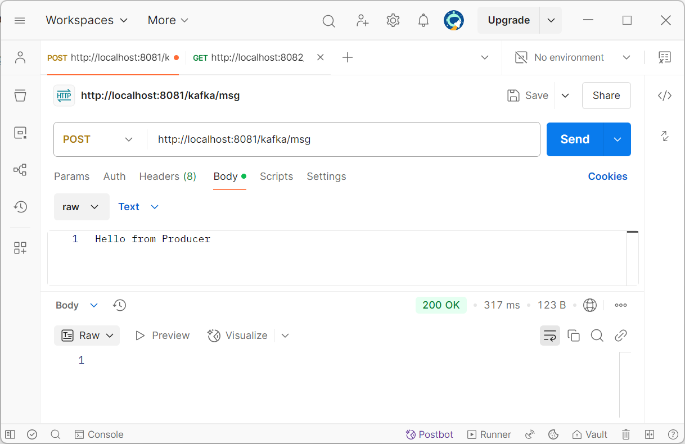
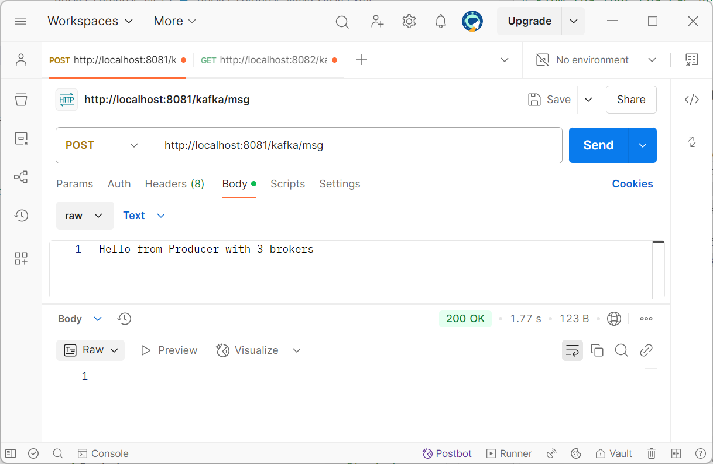
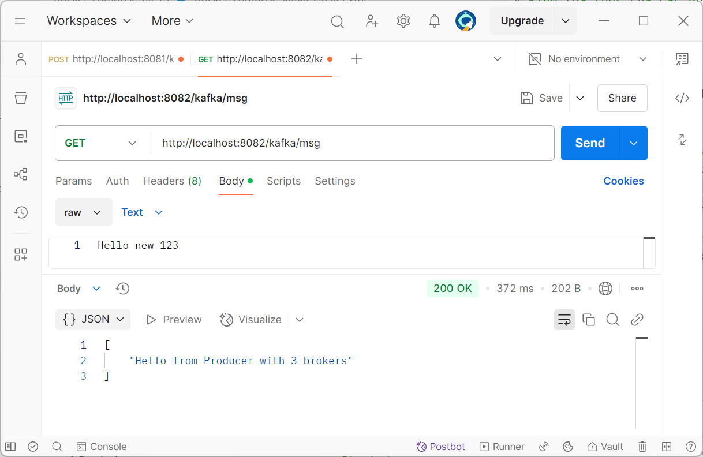
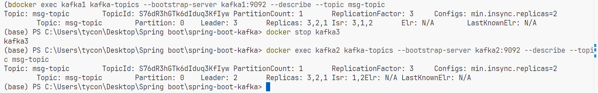
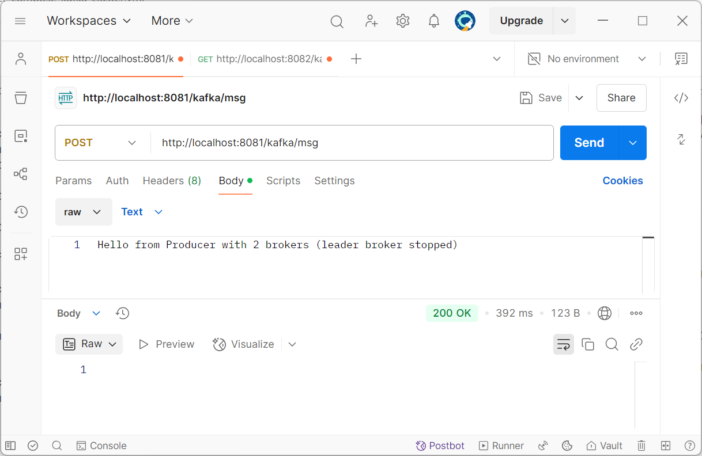
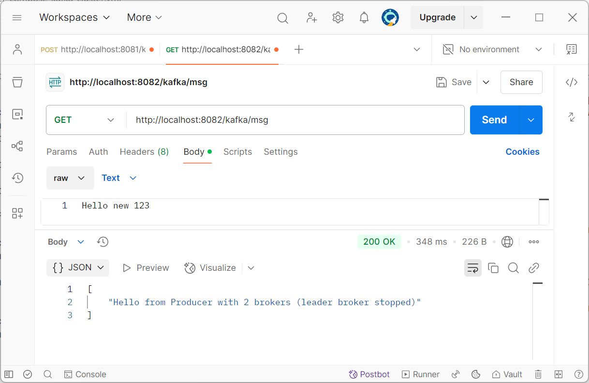

# Spring Boot Kafka

Name: Trần Vỹ Anh (StudentID: 22024508)

## Overview
This is to demonstrate two simple spring boot microservices which uses kafka to send and receive messages.

## Key Features
- Kafka cluster with 3 brokers for high availability and fault tolerance
- Partitioned topics with replication across brokers for data safety
- Minimum of 2 in-sync replicas requirement for ensuring data integrity
- Producer/Consumer microservices architecture with Apache Kafka messaging
- Docker containerization for easy deployment and scaling
- Comprehensive Docker Compose configurations for different deployment scenarios
- Postman collection for API testing and demonstration
- Configurable for both containerized and IDE-based development
- Thread-based execution in Consumer with internal message queuing
- Flexible message formats supporting both string and JSON data

## Screenshot
### 1. Kafka with 1 broker

Producer send message

Consumer receive message

### 2. Kafka with broker cluster
### 2.1. Kafka with all 3 broker

Producer send message

Consumer receive message

### 2.2. Kafka with leader broker stopped

When we stop leader broker (Kafka 3), Kafka automatically assign other broker as leader (Kafka 2)

Producer send message

Consumer receive message